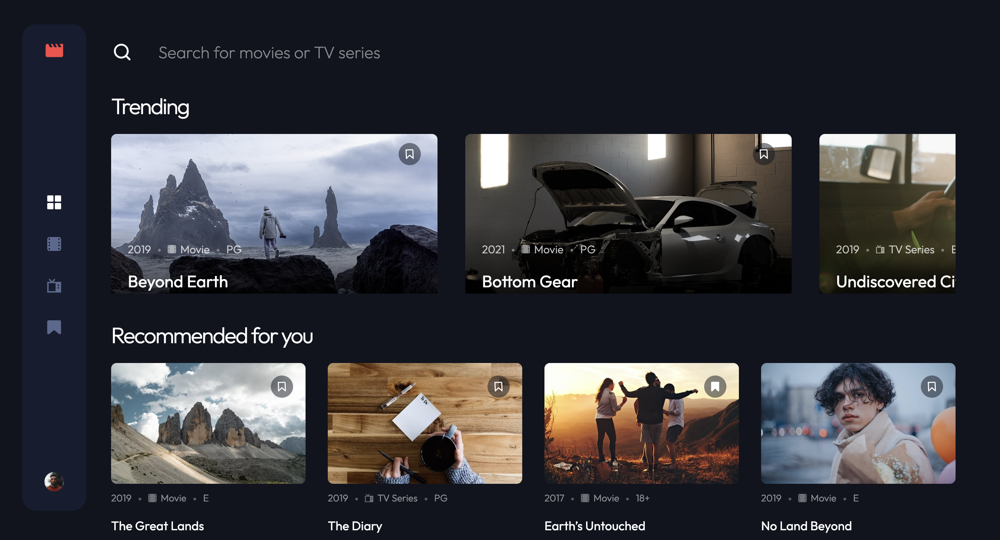

## Table of contents

- [Overview](#overview)
  - [The challenge](#the-challenge)
  - [Screenshot](#screenshot)
  - [Links](#links)
- [My process](#my-process)
  - [Built with](#built-with)
  - [What I learned](#what-i-learned)
  - [Continued development](#continued-development)
  - [Useful resources](#useful-resources)
- [Author](#author)

## Overview

### The challenge

Users should be able to:

- View the optimal layout for the app depending on their device's screen size
- See hover states for all interactive elements on the page
- Navigate between Home, Movies, TV Series, and Bookmarked Shows pages
- Add/Remove bookmarks from all movies and TV series
- Search for relevant shows on all pages
- **Bonus**: Build this project as a full-stack application
- **Bonus**: If you're building a full-stack app, we provide authentication screen (sign-up/login) designs if you'd like to create an auth flow

### Screenshot

### Links

[Live Site URL](https://video-app-ten-kappa.vercel.app/)

## My process

### Built with

- Semantic HTML5 markup
- CSS custom properties
- Flexbox
- CSS Grid
- Mobile-first workflow
- [Zustand](https://github.com/pmndrs/zustand) - React state management
- [React](https://reactjs.org/) - JS library
- [Next.js](https://nextjs.org/) - React framework
- [Typescript](https://www.typescriptlang.org) - Static type checker

### What I learned

- Got more familiar with typescript
- Used a new package called zustand that allows for simple state management without extra overhead ts/js

### Continued development

- Will create a new page that can display media (instead of the current photos only)
- Working signup and login page (connected to backend)
- Ability to filter media by more types

### Useful resources

- [Typescript handbook](https://www.typescriptlang.org/docs/handbook/intro.html) - This helped me for using Typescript with a react project

## Author

- Website - [Kris Bachan](https://kris-bachan-portfolio.vercel.app/)
- Frontend Mentor - [@k2pbac](https://www.frontendmentor.io/profile/k2pbac)
